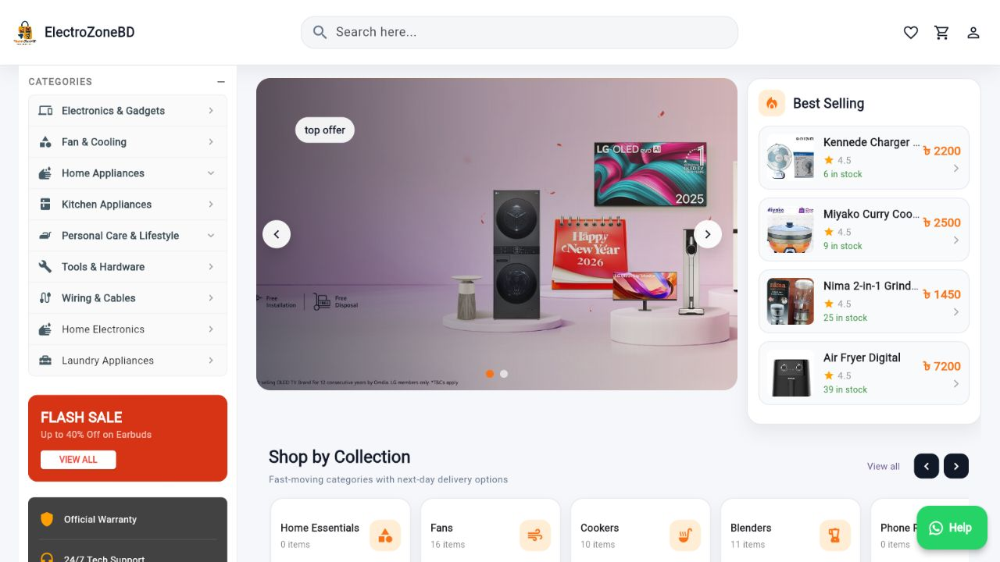
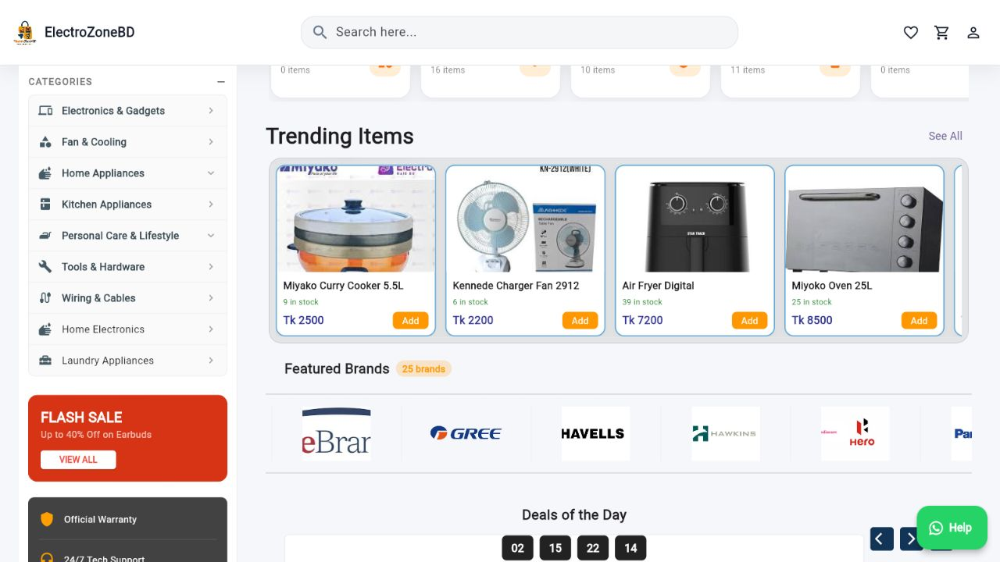
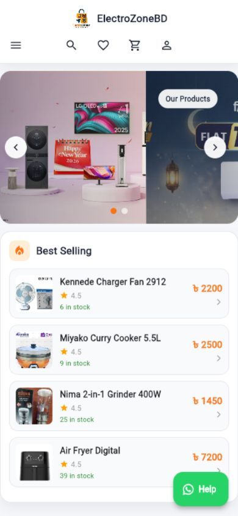

# ElectroZoneBD

| Flutter Web | PHP Backend | MySQL Database | Production Ready |
| --- | --- | --- | --- |

## Online Electronics Shopping Platform

ElectroZoneBD is a full-stack e-commerce web application for selling electronics, gadgets, home appliances, and tech products in Bangladesh. The project includes a Flutter Web customer storefront, a PHP REST API backend, a MySQL database, and a complete admin panel for managing products, orders, banners, customers, reports, and store settings.

---

## Table of Contents

- [Features](#features)
- [Live Preview](#live-preview)
- [Contributor](#contributor)
- [System Architecture](#system-architecture)
- [Technology Stack](#technology-stack)
- [Project Structure](#project-structure)
- [Local Setup](#local-setup)
- [Backend API](#backend-api)
- [Database](#database)
- [Admin Panel](#admin-panel)
- [Deployment](#deployment)
- [Security Notes](#security-notes)
- [Future Improvements](#future-improvements)

---

## Features

### Customer Website

- Responsive Flutter Web shopping interface
- Product browsing by category, collection, deals, flash sale, trending, and best-selling sections
- Product details with image, price, rating, description, and specifications
- Search and filtered product discovery
- Cart, checkout, and order flow
- Wishlist and profile pages
- Order tracking and order history
- Customer authentication with login, registration, and password reset
- Optimized image loading and production image URL resolver

### Admin Panel

- Admin dashboard with reports and store overview
- Product, brand, category, banner, collection, and featured brand management
- Order, customer, cart, payment, discount, flash sale, and deal management
- Stock management tools
- Delivery settings and site settings
- Database management screen
- Reports section for business monitoring

### Backend API

- PHP REST API for frontend and admin operations
- Authentication and session-related endpoints
- Product, category, brand, order, cart, wishlist, payment, banner, collection, review, rating, report, and upload APIs
- MySQL database connection layer
- Request validation, input sanitization, rate limiting, CORS configuration, and JWT utilities
- Email service support with PHPMailer integration

---

## Live Preview

Live website:

[https://electrozonebd.com/](https://electrozonebd.com/)

### Desktop Home



### Product Sections



### Mobile View



---

## Contributor

| Name | Role | GitHub |
| --- | --- | --- |
| Ahnaf Wadud Arnab | Full Stack Developer | [@AhnafwadudArnab](https://github.com/AhnafwadudArnab) |

---

## System Architecture

```text
Customer/Admin Browser
        |
        v
Flutter Web Application
        |
        v
PHP REST API Backend
        |
        v
MySQL Database
```

The Flutter web app communicates with the PHP backend through REST API endpoints. The backend handles validation, authentication, business logic, uploads, and database operations. MySQL stores users, products, carts, orders, banners, reports, settings, and related e-commerce data.

---

## Technology Stack

| Layer | Technology |
| --- | --- |
| Frontend | Flutter Web, Dart |
| State Management | Provider, Get |
| Backend | PHP 7.4+ |
| Database | MySQL |
| Email | PHPMailer |
| Charts & Reports | fl_chart |
| Images | cached_network_image, flutter_svg |
| Payments UI | SSLCommerz-related pages and payment method modules |
| Deployment Target | cPanel / shared hosting |

---

## Project Structure

```text
electrocitybd_upto/
|-- assets/                 # App images, product media, logos, category assets
|-- backend/                # PHP backend API, models, controllers, middleware
|   |-- api/                # API endpoint files
|   |-- config/             # Environment, DB, and CORS configuration
|   |-- controllers/        # Backend controllers
|   |-- middleware/         # Auth, CSRF, validation, rate limiter
|   |-- models/             # Product, user, order, cart, category models
|   |-- public/             # Public PHP entry point and uploads
|   |-- services/           # Email service implementations
|   `-- util/               # DB connection, response, JWT, logger utilities
|-- databaseMysql/          # MySQL structure, data, and fix scripts
|-- lib/                    # Flutter web application source
|   |-- config/             # App configuration
|   `-- Front-end/          # Pages, widgets, providers, admin panel, utils
|-- web/                    # Flutter web shell, manifest, icons, htaccess
|-- deploy_packages/        # cPanel deployment packages and hotfix zips
|-- pubspec.yaml            # Flutter dependencies and asset declarations
`-- README.md               # Project documentation
```

---

## Local Setup

### Requirements

- Flutter SDK
- Dart SDK
- PHP 7.4 or newer
- MySQL
- Composer
- Chrome or another supported browser

### Install Flutter Dependencies

```bash
flutter pub get
```

### Start Backend

Using VS Code task:

```text
Start Backend
```

Default health check:

```text
http://127.0.0.1:8080/api/health
```

### Start Flutter Web

Using VS Code task:

```text
Start Flutter Web
```

Default local URL:

```text
http://localhost:5000
```

### Start Both

Using VS Code task:

```text
Start All (Backend + Flutter)
```

You can also run Flutter manually:

```bash
flutter run -d chrome --web-port=5000
```

---

## Backend API

Important API areas include:

- `auth`
- `products`
- `categories`
- `brands`
- `cart`
- `orders`
- `wishlist`
- `payments`
- `banners`
- `collections`
- `flash_sales`
- `deals`
- `reports`
- `reviews`
- `ratings`
- `upload`
- `site_settings`

Production API base:

```text
https://electrozonebd.com/api
```

Health endpoint:

```text
https://electrozonebd.com/api/health
```

---

## Database

Database files are stored in:

```text
databaseMysql/
```

Important SQL files:

- `electrobd_structure.sql`
- `electrobd_data.sql`
- `asiment1_electrobd.sql`
- `admin_users.sql`
- `fix_all_issues.sql`
- `fix_all_problems.sql`

Typical database setup:

1. Create a MySQL database.
2. Create a database user and assign permissions.
3. Import the structure SQL file.
4. Import required data SQL files.
5. Update backend environment variables with the database credentials.

---

## Admin Panel

The admin panel is included inside the Flutter app under:

```text
lib/Front-end/Admin Panel/
```

Major admin modules:

- Dashboard
- Products
- Orders
- Customers
- Brands
- Banners
- Collections
- Flash sales
- Deals and discounts
- Payments
- Reports
- Stock management
- Delivery settings
- Site settings
- Database management

---

## Deployment

This project is prepared for cPanel deployment.

### Frontend Build

```bash
flutter build web --release --dart-define=API_URL=https://electrozonebd.com
```

Upload the generated `build/web/` contents to the domain root.

### Backend Upload

Upload the backend folder to the server and make sure the API route points correctly to the backend public entry point.

### cPanel Target

```text
/home/asiment1/electrozonebd.com
```

### Deployment Packages

Deployment-ready packages are stored in:

```text
deploy_packages/
```

For the latest font/icon hotfix, use:

```text
deploy_packages/electrozonebd_font_assets_safe_hotfix_20260707_1530.zip
```

This hotfix updates Flutter font assets, `FontManifest.json`, `index.html`, `flutter_bootstrap.js`, and `.htaccess`.

---

## Security Notes

- Do not commit production `.env` files.
- Keep database credentials only on the backend.
- Use a strong `JWT_SECRET`.
- Enable HTTPS in production.
- Keep CORS restricted to trusted domains.
- Protect upload endpoints with validation.
- Keep admin access limited to authorized users.
- Review PHP and server error logs after deployment.

---

## Future Improvements

- Complete live bKash/Nagad/SSLCommerz production payment integration
- Add automated API tests
- Add CI/CD deployment workflow
- Add inventory alert automation
- Improve analytics and sales reporting
- Add advanced coupon and campaign management
- Add customer support ticket tracking

---

## Project Status

The project is production-ready for the main e-commerce workflow. Core modules such as authentication, products, cart, orders, admin panel, reports, and deployment packaging are already included.

---

## License

This project is created for academic and portfolio use. Update this section with the final license before making the repository public.
